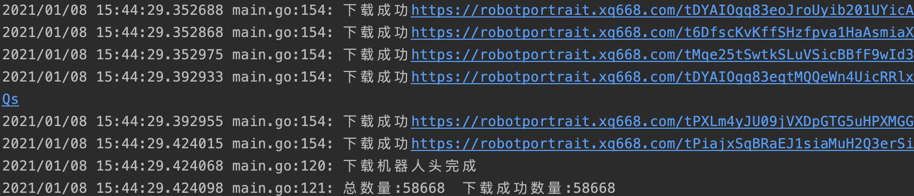

# downloadrobotheadscript

多线程下载图片

## 说明

1.读取csv文件中图片信息

2.遍历图片信息并发下载

3.计数(下载成功数量)



## 参数说明

-file  图片信息文件地址

-logfile 输出日志信息地址

## 使用

```
 # 确保当前目录下存在pic目录(用于存放下载的图片文件)
 go run main.go  
```


## 代码

文件信息

```go
// 下载机器人头像的信息
type RobotUrl struct {
	ID int64 `json:"id"`
	State int `json:"state"`
	ImgUrl string `json:"img_url"`
	LogDate string `json:"log_date"`
	LogTime string `json:"log_time"`
}
```


```go
// 下载单个文件
func downloadPic(robotAvatar RobotUrl) {
	goLimit <- 1
	defer func() {
		<-goLimit
		finish.Done()
	}()
	res, err := http.Get(robotAvatar.ImgUrl)
	if err != nil {
		myLog.Printf("downloadPic 文件下载失败:%v\n", err)
		return
	}
	data ,err := ioutil.ReadAll(res.Body)
	if err != nil {
		myLog.Printf("downloadPic 读取数据失败:%v\n", err)
		return
	}
	newFile, err := os.Create(fmt.Sprintf("%vrobot-%d.png", picDir, robotAvatar.ID))
	if err != nil {
		myLog.Printf("downloadPic 创建文件失败:%v\n", err)
		return
	}
	defer newFile.Close()
	err = ioutil.WriteFile(fmt.Sprintf("%vrobot-%d.png", picDir, robotAvatar.ID), data, 0644)
	if err != nil {
		myLog.Printf("downloadPic err:%v\n", err)
		return
	}
	downCount.mutex.Lock()
	downCount.count++
	downCount.mutex.Unlock()
	myLog.Printf("下载成功%v\n", robotAvatar.ImgUrl)
}

```

